---
## Front matter
lang: ru-RU
title: Лабораторная работа № 1
subtitle: Знакомство с Cisco Packet Tracer
author:
  - Шияпова Д.И.
institute:
  - Российский университет дружбы народов, Москва, Россия
date: 05 апреля 2025

## i18n babel
babel-lang: russian
babel-otherlangs: english

## Formatting pdf
toc: false
toc-title: Содержание
slide_level: 2
aspectratio: 169
section-titles: true
theme: metropolis
header-includes:
 - \metroset{progressbar=frametitle,sectionpage=progressbar,numbering=fraction}
---

## Докладчик

:::::::::::::: {.columns align=center}
::: {.column width="70%"}

  * Шияпова Дарина Илдаровна
  * Студентка
  * Российский университет дружбы народов
  * [1132226458@pfur.ru](mailto:1132226458@pfur.ru)

:::
::: {.column width="30%"}

:::
::::::::::::::

## Цель работы

Установить инструмент моделирования конфигурации сети Cisco Packet Tracer, ознакомиться с его интерфейсом.

## Задание

1. Установить на домашнем устройстве Cisco Packet Tracer.

2. Построить простейшую сеть в Cisco Packet Tracer, провести простейшую настройку оборудования.

## Выполнение лабораторной работы

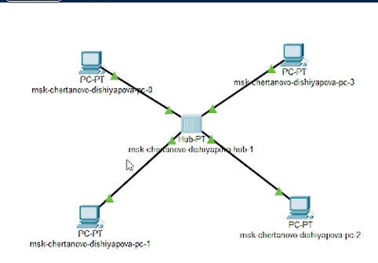{#fig:001 width=70%}

## Выполнение лабораторной работы

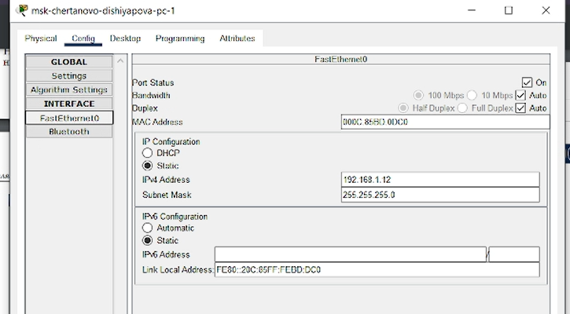{#fig:002 width=70%}

## Выполнение лабораторной работы

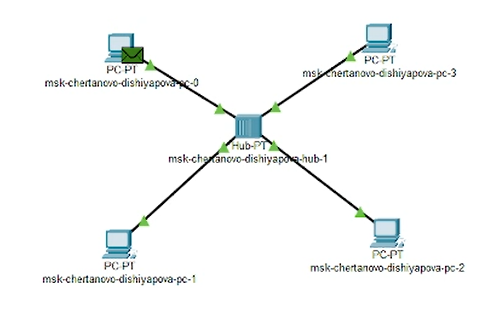{#fig:003 width=70%}

## Выполнение лабораторной работы

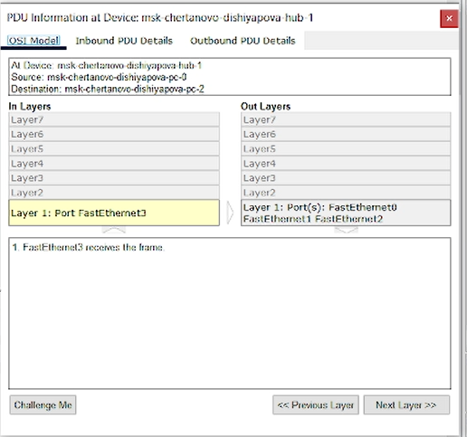{#fig:004 width=50%}

## Выполнение лабораторной работы

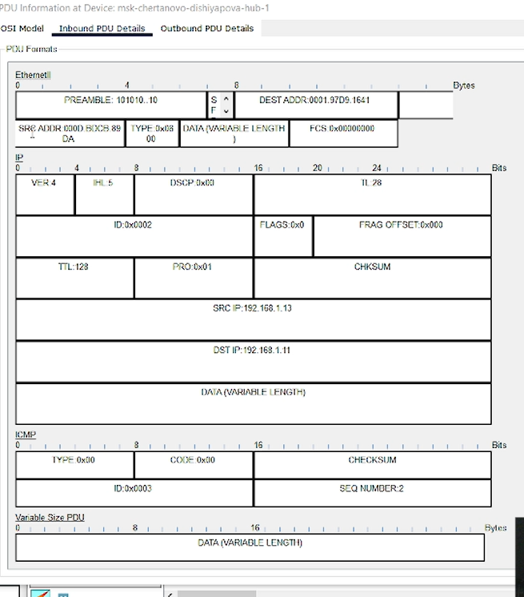{#fig:005 width=50%}

## Выполнение лабораторной работы

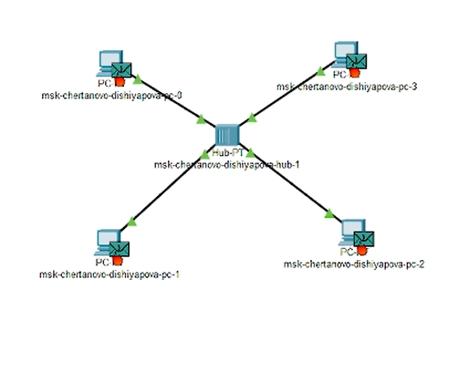{#fig:006 width=70%}

## Выполнение лабораторной работы

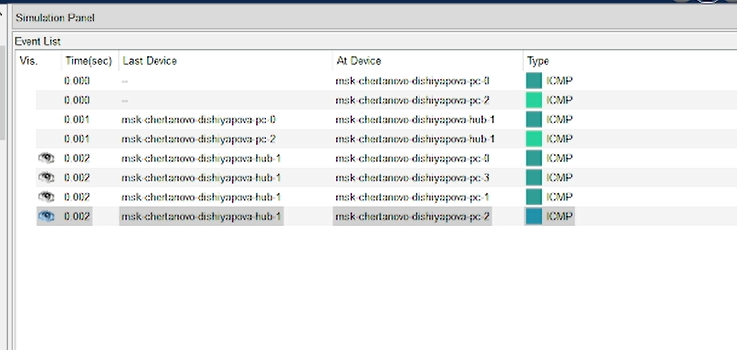{#fig:008 width=70%}

## Выполнение лабораторной работы

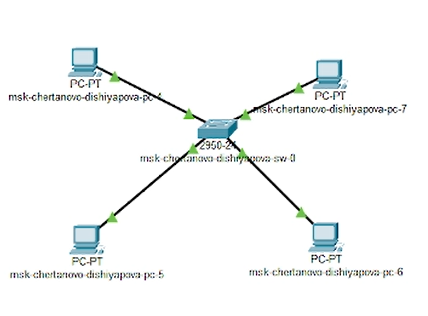{#fig:009 width=50%}

## Выполнение лабораторной работы

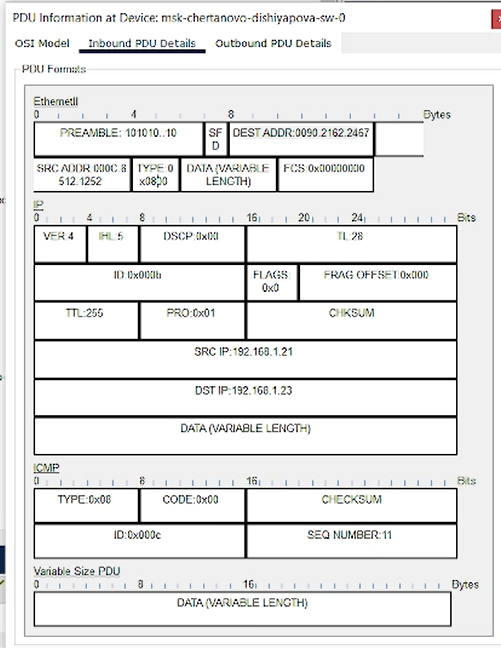{#fig:010 width=50%}

## Выполнение лабораторной работы
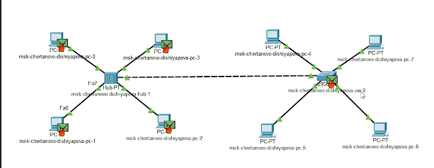{#fig:011 width=70%}

## Выполнение лабораторной работы

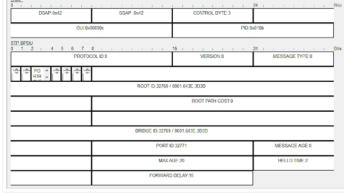{#fig:012 width=50%}

## Выполнение лабораторной работы

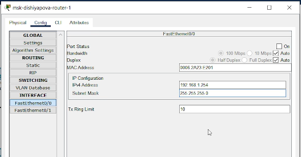{#fig:013 width=50%}

## Выполнение лабораторной работы

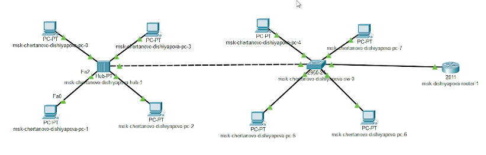{#fig:014 width=70%}

## Выполнение лабораторной работы

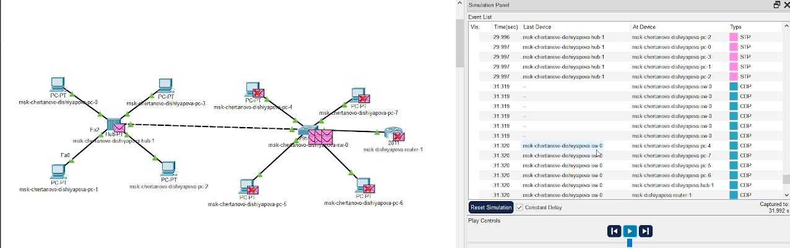{#fig:015 width=70%}

## Выполнение лабораторной работы

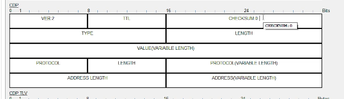{#fig:016 width=70%}

## Выводы

В процессе выполнения данной лабораторной работы я установила инструмент моделирования конфигурации сети Cisco Packet Tracer и ознакомилась с его интерфейсом.
:::

