---
## Front matter
lang: ru-RU
title: Лабораторная работа № 2
subtitle: Предварительная настройка оборудования Cisco
author:
  - Шияпова Д.И.
institute:
  - Российский университет дружбы народов, Москва, Россия
date: 05 апреля 2025

## i18n babel
babel-lang: russian
babel-otherlangs: english

## Formatting pdf
toc: false
toc-title: Содержание
slide_level: 2
aspectratio: 169
section-titles: true
theme: metropolis
header-includes:
 - \metroset{progressbar=frametitle,sectionpage=progressbar,numbering=fraction}
---

## Докладчик

:::::::::::::: {.columns align=center}
::: {.column width="70%"}

  * Шияпова Дарина Илдаровна
  * Студентка
  * Российский университет дружбы народов
  * [1132226458@pfur.ru](mailto:1132226458@pfur.ru)

:::
::: {.column width="30%"}

:::
::::::::::::::

## Цель работы

Получить основные навыки по начальному конфигурированию оборудования Cisco.

## Задание

1. Сделать предварительную настройку маршрутизатора:

- задать имя в виде «город-территория-учётная_записьтип_оборудования-номер»;

- задать интерфейсу Fast Ethernet с номером 0 ip-адрес 192.168.1.254 и маску 255.255.255.0, затем поднять интерфейс;

- задать пароль для доступа к привилегированному режиму (сначала в открытом виде, затем — в зашифрованном);

- настроить доступ к оборудованию сначала через telnet, затем — через ssh (используя в качестве имени домена donskaya.rudn.edu);

- сохранить и экспортировать конфигурацию в отдельный файл.

## Задание

2. Сделать предварительную настройку коммутатора:

- задать имя в виде «город-территория-учётная_записьтип_оборудования-номер» 
 
- задать интерфейсу vlan 2 ip-адрес 192.168.2.1 и маску 255.255.255.0, затем поднять интерфейс;

- привязать интерфейс Fast Ethernet с номером 1 к vlan 2;

- задать в качестве адреса шлюза по умолчанию адрес 192.168.2.254;

- задать пароль для доступа к привилегированному режиму (сначала в открытом виде, затем — в зашифрованном);

- настроить доступ к оборудованию сначала через telnet, затем — через ssh (используя в качестве имени домена donskaya.rudn.edu);

- для пользователя admin задать доступ 1-го уровня по паролю;

- сохранить и экспортировать конфигурацию в отдельный файл.

## Выполнение лабораторной работы

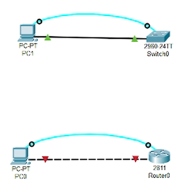{#fig:001 width=70%}

## Выполнение лабораторной работы

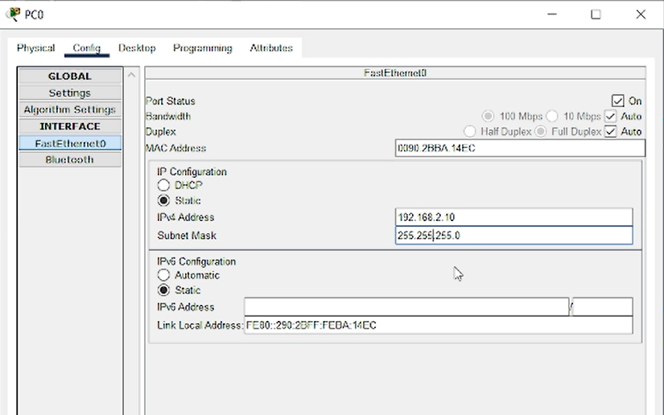{#fig:002 width=70%}

## Выполнение лабораторной работы

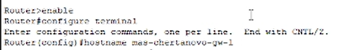{#fig:003 width=70%}

## Выполнение лабораторной работы

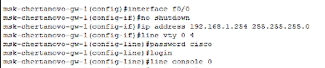{#fig:004 width=70%}

## Выполнение лабораторной работы

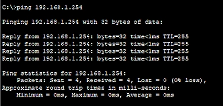{#fig:005 width=70%}

## Выполнение лабораторной работы

{#fig:006 width=70%}

## Выполнение лабораторной работы

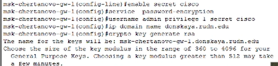{#fig:008 width=70%}

## Выполнение лабораторной работы

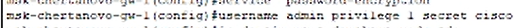{#fig:010 width=70%}

## Выполнение лабораторной работы

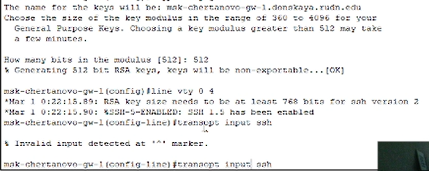{#fig:011 width=70%}

## Выполнение лабораторной работы

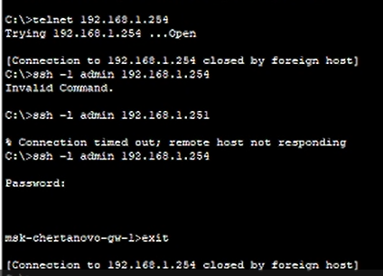{#fig:012 width=70%}

## Выполнение лабораторной работы

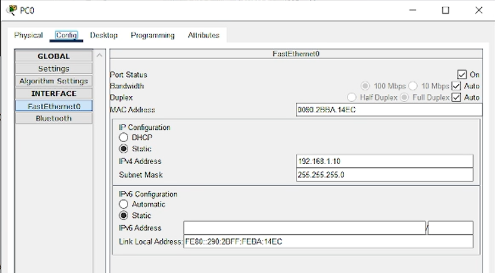{#fig:014 width=70%}

## Выполнение лабораторной работы

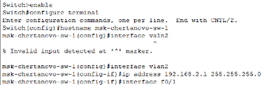{#fig:015 width=70%}

## Выполнение лабораторной работы

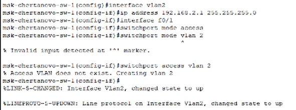{#fig:016 width=70%}

## Выполнение лабораторной работы

{#fig:017 width=70%}

## Выполнение лабораторной работы

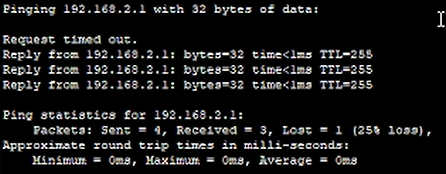{#fig:018 width=70%}

## Выводы

В процессе выполнения данной лабораторной работы я получила основные навыки по начальному конфигурированию оборудования Cisco.

:::

