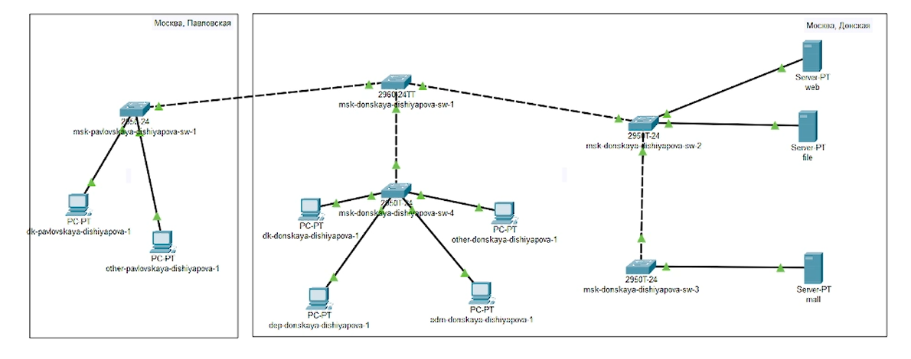
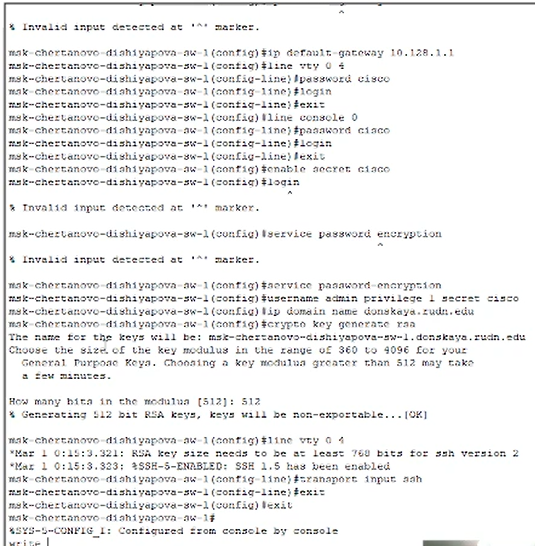
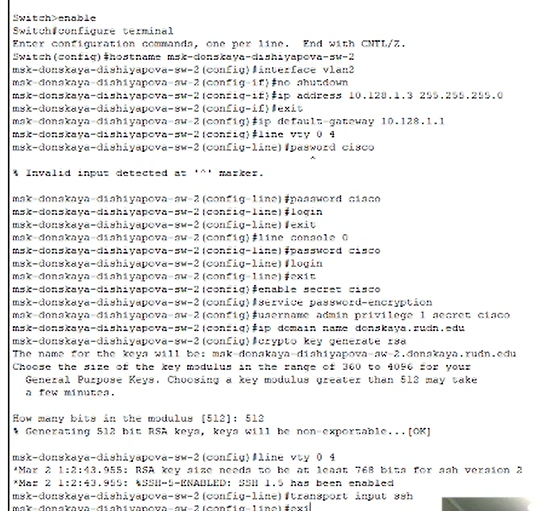
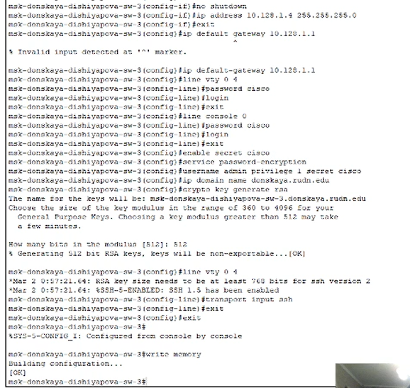
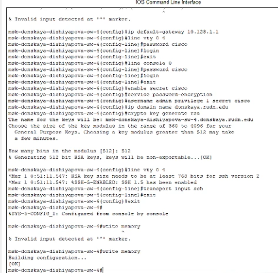
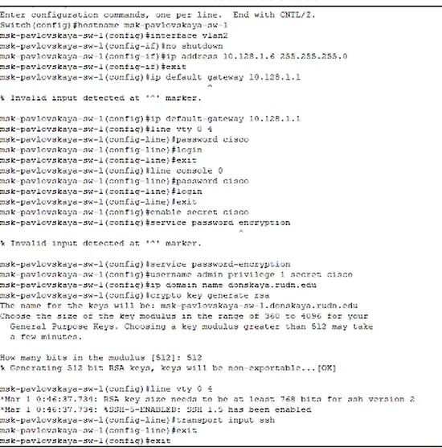

---
## Front matter
lang: ru-RU
title: Лабораторная работа № 4
subtitle: Первоначальное конфигурирование сети
author:
  - Шияпова Д.И.
institute:
  - Российский университет дружбы народов, Москва, Россия
date: 05 апреля 2025

## i18n babel
babel-lang: russian
babel-otherlangs: english

## Formatting pdf
toc: false
toc-title: Содержание
slide_level: 2
aspectratio: 169
section-titles: true
theme: metropolis
header-includes:
 - \metroset{progressbar=frametitle,sectionpage=progressbar,numbering=fraction}
---

## Докладчик

:::::::::::::: {.columns align=center}
::: {.column width="70%"}

  * Шияпова Дарина Илдаровна
  * Студентка
  * Российский университет дружбы народов
  * [1132226458@pfur.ru](mailto:1132226458@pfur.ru)

:::
::: {.column width="30%"}

:::
::::::::::::::

## Цель работы

Провести подготовительную работу по первоначальной настройке коммутаторов сети.

## Задание

Требуется сделать первоначальную настройку коммутаторов сети, представленной на схеме L1. Под первоначальной настройкой понимается указание имени устройства, его IP-адреса, настройка доступа по паролю к виртуальным терминалам и консоли, настройка удалённого доступа к устройству по ssh.
При выполнении работы необходимо учитывать соглашение об именовании.

## Выполнение лабораторной работы

{#fig:001 width=70%}

## Выполнение лабораторной работы

{#fig:002 width=30%}

## Выполнение лабораторной работы

{#fig:003 width=30%}

## Выполнение лабораторной работы

{#fig:004 width=30%}

## Выполнение лабораторной работы

{#fig:005 width=30%}

## Выполнение лабораторной работы

{#fig:006 width=30%}

## Выводы

В результате выполнения данной лабораторной работы я провела подготовительную работу по первоначальной настройке коммутаторов сети.
