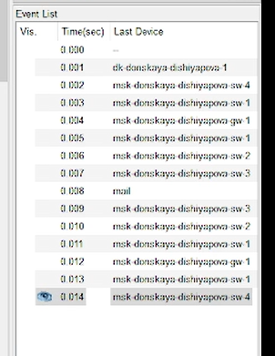
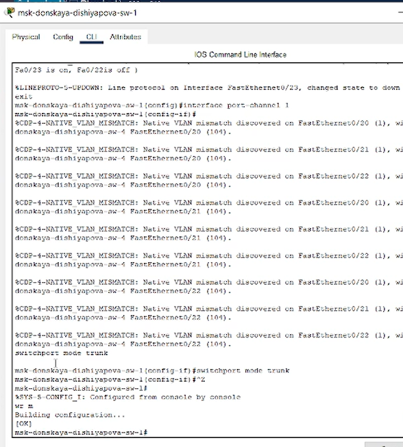

---
## Front matter
lang: ru-RU
title: Лабораторная работа № 9
subtitle: Использование протокола STP. Агрегирование каналов
author:
  - Шияпова Д.И.
institute:
  - Российский университет дружбы народов, Москва, Россия
date: 19 апреля 2025

## i18n babel
babel-lang: russian
babel-otherlangs: english

## Formatting pdf
toc: false
toc-title: Содержание
slide_level: 2
aspectratio: 169
section-titles: true
theme: metropolis
header-includes:
 - \metroset{progressbar=frametitle,sectionpage=progressbar,numbering=fraction}
---

## Докладчик

:::::::::::::: {.columns align=center}
::: {.column width="70%"}

  * Шияпова Дарина Илдаровна
  * Студентка
  * Российский университет дружбы народов
  * [1132226458@pfur.ru](mailto:1132226458@pfur.ru)

:::
::: {.column width="30%"}

:::
::::::::::::::

## Цель работы

Изучить возможности протокола STP и его модификаций по обеспечению
отказоустойчивости сети, агрегированию интерфейсов и перераспределению
нагрузки между ними.

## Задание

1. Сформировать резервное соединение между коммутаторами msk-donskayasw-1 и msk-donskaya-sw-3.
2. Настроить балансировку нагрузки между резервными соединениями.
3. Настроить режим Portfast на тех интерфейсах коммутаторов, к которым подключены серверы.

## Задание

4. Изучить отказоустойчивость резервного соединения.
5. Сформировать и настроить агрегированное соединение интерфейсов Fa0/20 -- Fa0/23 между коммутаторами msk-donskaya-sw-1 и msk-donskaya-sw-4.
6. При выполнении работы необходимо учитывать соглашение об именовании.

## Выполнение лабораторной работы

{#fig:001 width=70%}

## Выполнение лабораторной работы

{#fig:002 width=70%}

## Выполнение лабораторной работы

{#fig:003 width=70%}

## Выполнение лабораторной работы

{#fig:004 width=70%}

## Выполнение лабораторной работы

{#fig:005 width=70%}

## Выполнение лабораторной работы

{#fig:006 width=70%}

## Выполнение лабораторной работы

{#fig:007 width=70%}

## Выполнение лабораторной работы

{#fig:008 width=70%}

## Выполнение лабораторной работы

{#fig:009 width=70%}

## Выполнение лабораторной работы

{#fig:010 width=70%}

## Выполнение лабораторной работы

{#fig:011 width=70%}

## Выполнение лабораторной работы

{#fig:012 width=70%}

## Выполнение лабораторной работы

{#fig:013 width=70%}

## Выполнение лабораторной работы

{#fig:014 width=70%}

## Выполнение лабораторной работы

{#fig:015 width=70%}

## Выполнение лабораторной работы

{#fig:017 width=70%}

## Выполнение лабораторной работы

{#fig:018 width=70%}

## Выполнение лабораторной работы

{#fig:019 width=70%}

## Выполнение лабораторной работы

{#fig:020 width=70%}

## Выполнение лабораторной работы

{#fig:021 width=70%}

## Выполнение лабораторной работы

{#fig:022 width=70%}

## Выполнение лабораторной работы

{#fig:023 width=70%}

## Выполнение лабораторной работы

{#fig:024 width=70%}

## Выполнение лабораторной работы

{#fig:029 width=70%}

## Выполнение лабораторной работы

{#fig:026 width=70%}

## Выполнение лабораторной работы

{#fig:027 width=70%}

## Выводы

В результате выполнения лабораторной работы я изучила возможности протокола STP и его модификаций по обеспечению
отказоустойчивости сети, агрегированию интерфейсов и перераспределению нагрузки между ними.
