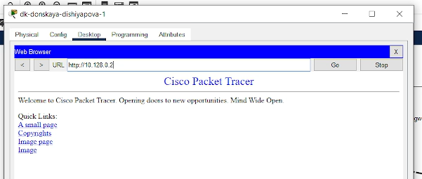

---
## Front matter
lang: ru-RU
title: Лабораторная работа № 10
subtitle: Настройка списков управления доступом (ACL)
author:
  - Шияпова Д.И.
institute:
  - Российский университет дружбы народов, Москва, Россия
date: 19 апреля 2025

## i18n babel
babel-lang: russian
babel-otherlangs: english

## Formatting pdf
toc: false
toc-title: Содержание
slide_level: 2
aspectratio: 169
section-titles: true
theme: metropolis
header-includes:
 - \metroset{progressbar=frametitle,sectionpage=progressbar,numbering=fraction}
---

## Докладчик

:::::::::::::: {.columns align=center}
::: {.column width="70%"}

  * Шияпова Дарина Илдаровна
  * Студентка
  * Российский университет дружбы народов
  * [1132226458@pfur.ru](mailto:1132226458@pfur.ru)

:::
::: {.column width="30%"}

:::
::::::::::::::

## Цель работы

Освоить настройку прав доступа пользователей к ресурсам сети.

## Задание

1. Требуется настроить следующие правила доступа:
   - web-сервер: разрешить доступ всем пользователям по протоколу HTTP
через порт 80 протокола TCP, а для администратора открыть доступ
по протоколам Telnet и FTP;
   - файловый сервер: с внутренних адресов сети доступ открыт по портам
для общедоступных каталогов, с внешних — доступ по протоколу FTP;

## Задание

   - почтовый сервер: разрешить пользователям работать по протоколам
SMTP и POP3 (соответственно через порты 25 и 110 протокола TCP),
а для администратора — открыть доступ по протоколам Telnet и FTP;
   - DNS-сервер: открыть порт 53 протокола UDP для доступа из внутренней сети;
   - разрешить icmp-сообщения, направленные в сеть серверов;
   - запретить для сети Other любые запросы за пределы сети, за исключением администратора;
   - разрешить доступ в сеть управления сетевым оборудованием только
администратору сети.

## Задание

2. Требуется проверить правильность действия установленных правил доступа.
3. Требуется выполнить задание для самостоятельной работы по настройке
прав доступа администратора сети на Павловской.
4. При выполнении работы необходимо учитывать соглашение об именовании.

## Выполнение лабораторной работы

{#fig:001 width=70%}

## Выполнение лабораторной работы

{#fig:002 width=70%}

## Выполнение лабораторной работы

{#fig:003 width=70%}

## Выполнение лабораторной работы

{#fig:004 width=70%}

## Выполнение лабораторной работы
  
{#fig:005 width=70%}

## Выполнение лабораторной работы

{#fig:006 width=70%}

## Выполнение лабораторной работы

{#fig:007 width=70%}

## Выполнение лабораторной работы

{#fig:008 width=70%}

## Выполнение лабораторной работы

{#fig:009 width=70%}

## Выполнение лабораторной работы

{#fig:010 width=70%}

## Выполнение лабораторной работы

{#fig:011 width=70%}

## Выполнение лабораторной работы

{#fig:012 width=70%}

## Выполнение лабораторной работы

{#fig:013 width=70%}

## Выполнение лабораторной работы

{#fig:014 width=70%}

## Выполнение лабораторной работы

{#fig:015 width=70%}

## Выполнение лабораторной работы

{#fig:016 width=70%}

## Выполнение лабораторной работы

{#fig:017 width=70%}

## Выполнение лабораторной работы

{#fig:018 width=70%}

## Выполнение лабораторной работы

{#fig:019 width=70%}

## Выполнение лабораторной работы

{#fig:020 width=70%}

## Самостоятельная работа

{#fig:022 width=70%}

## Самостоятельная работа

{#fig:023 width=70%}

## Самостоятельная работа

{#fig:024 width=70%}

## Самостоятельная работа

{#fig:025 width=70%}

## Самостоятельная работа

{#fig:026 width=70%}

## Самостоятельная работа

{#fig:028 width=60%}

## Выводы

В процессе выполнения данной лабораторной работы я освоила настройку прав доступа пользователей к ресурсам сети.

