---
## Front matter
title: "Лабораторная работа № 10"
subtitle: "Настройка списков управления доступом (ACL)"
author: "Шияпова Дарина Илдаровна"

## Generic otions
lang: ru-RU
toc-title: "Содержание"

## Bibliography
bibliography: bib/cite.bib
csl: pandoc/csl/gost-r-7-0-5-2008-numeric.csl

## Pdf output format
toc: true # Table of contents
toc-depth: 2
lof: true # List of figures
lot: false # List of tables
fontsize: 12pt
linestretch: 1.5
papersize: a4
documentclass: scrreprt
## I18n polyglossia
polyglossia-lang:
  name: russian
  options:
	- spelling=modern
	- babelshorthands=true
polyglossia-otherlangs:
  name: english
## I18n babel
babel-lang: russian
babel-otherlangs: english
## Fonts
mainfont: PT Serif
romanfont: PT Serif
sansfont: PT Sans
monofont: PT Mono
mainfontoptions: Ligatures=TeX
romanfontoptions: Ligatures=TeX
sansfontoptions: Ligatures=TeX,Scale=MatchLowercase
monofontoptions: Scale=MatchLowercase,Scale=0.9
## Biblatex
biblatex: true
biblio-style: "gost-numeric"
biblatexoptions:
  - parentracker=true
  - backend=biber
  - hyperref=auto
  - language=auto
  - autolang=other*
  - citestyle=gost-numeric
## Pandoc-crossref LaTeX customization
figureTitle: "Рис."
tableTitle: "Таблица"
listingTitle: "Листинг"
lofTitle: "Список иллюстраций"
lotTitle: "Список таблиц"
lolTitle: "Листинги"
## Misc options
indent: true
header-includes:
  - \usepackage{indentfirst}
  - \usepackage{float} # keep figures where there are in the text
  - \floatplacement{figure}{H} # keep figures where there are in the text
---

# Цель работы

Освоить настройку прав доступа пользователей к ресурсам сети.

# Задание

1. Требуется настроить следующие правила доступа:
   - web-сервер: разрешить доступ всем пользователям по протоколу HTTP
через порт 80 протокола TCP, а для администратора открыть доступ
по протоколам Telnet и FTP;
   - файловый сервер: с внутренних адресов сети доступ открыт по портам
для общедоступных каталогов, с внешних — доступ по протоколу FTP;
   - почтовый сервер: разрешить пользователям работать по протоколам
SMTP и POP3 (соответственно через порты 25 и 110 протокола TCP),
а для администратора — открыть доступ по протоколам Telnet и FTP;
   - DNS-сервер: открыть порт 53 протокола UDP для доступа из внутренней сети;
   - разрешить icmp-сообщения, направленные в сеть серверов;
   - запретить для сети Other любые запросы за пределы сети, за исключением администратора;
   - разрешить доступ в сеть управления сетевым оборудованием только
администратору сети.
2. Требуется проверить правильность действия установленных правил доступа.
3. Требуется выполнить задание для самостоятельной работы по настройке
прав доступа администратора сети на Павловской.
4. При выполнении работы необходимо учитывать соглашение об именовании.

# Выполнение лабораторной работы

В рабочей области проекта подключим ноутбук администратора с именем
admin к сети к other-donskaya-1 (рис. [-@fig:001]) с тем, чтобы разрешить ему потом любые
действия, связанные с управлением сетью. Для этого подсоединим ноутбук
к порту 24 коммутатора msk-donskaya-sw-4 и присвоим ему статический
адрес 10.128.6.200 (рис. [-@fig:002]), указав в качестве gateway-адреса 10.128.6.1 и адреса
DNS-сервера 10.128.0.5 (рис. [-@fig:003]).

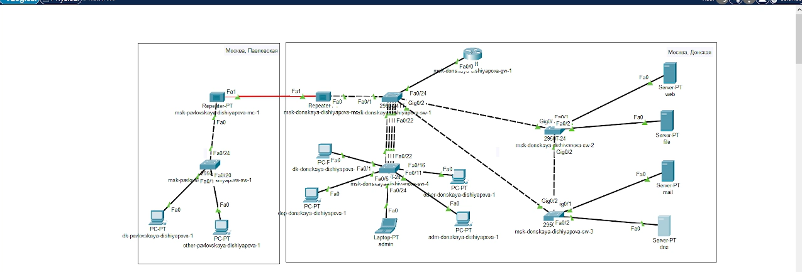{#fig:001 width=70%}

{#fig:002 width=70%}

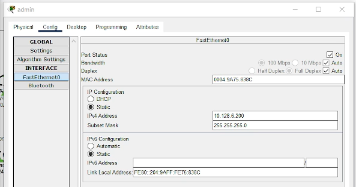{#fig:003 width=70%}

Проверим, что у ноутбука корректно работает соединение через пингование разных устройств сети, например серверов (рис. [-@fig:004]).

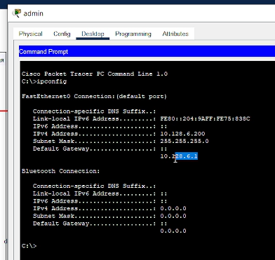{#fig:004 width=70%}

На оборудовании Cisco правила в списке доступа
проверяются по порядку сверху вниз до первого совпадения — как только
одно из правил сработало, проверка списка правил прекращается и обработка
трафика происходит на основе сработавшего правила. Поэтому
сначала мы надо давать разрешение (permit) на какое-то действие, а уже потом накладывать ограничения (deny).

Настроем доступ к web-серверу по порту tcp 80 (рис.[-@fig:005]). Мы создаем список контроля доступа с названием servers-out (так как
предполагается ограничить доступ в конкретные подсети и по отношению к маршрутизатору это будет исходящий трафик); указано (в качестве
комментария-напоминания remark web), что ограничения предназначены
для работы с web-сервером, а также даем разрешение доступа (permit) по протоколу TCP всем (any) пользователям сети (host) на доступ к web-серверу,
имеющему адрес 10.128.0.2, через порт 80.
  
{#fig:005 width=70%}

Добавим список управления доступом к интерфейсу (рис.[-@fig:006]). К интерфейсу f0/0.3 подключается список прав доступа servers-out и применяется к исходящему трафику (out).

{#fig:006 width=70%}

Проверим, что доступ к web-серверу есть через протокол HTTP,введя в строке браузера хоста ip-адрес web-сервера (рис.[-@fig:007]). При этом команда ping будет демонстрировать недоступность web-сервера как по имени, так и по ip-адресу web-сервера (рис.[-@fig:008]).

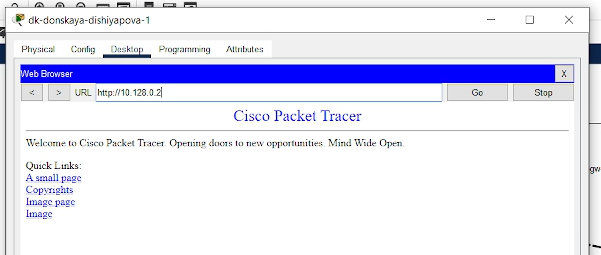{#fig:007 width=70%}

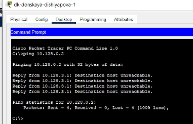{#fig:008 width=70%}

Настроем дополнительный доступ для администратора по протоколам Telnet и FTP (рис.[-@fig:009]). В список контроля доступа servers-out добавлено правило, разрешающее устройству администратора с ip-адресом 10.128.6.200 доступ на
web-сервер (10.128.0.2) по протоколам FTP и telnet.

{#fig:009 width=70%}

Убедимся, что с узла с ip-адресом 10.128.6.200 есть доступ по протоколу FTP (рис.[-@fig:010]). Для этого в командной строке устройства администратора введем
ftp 10.128.0.2, а затем по запросу имя пользователя cisco и пароль cisco, увидим, что доступ действительно есть.

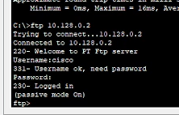{#fig:010 width=70%}

Попробуем провести аналогичную процедуру с другого устройства сети (рис.[-@fig:011]). Увидим, что доступ запрещён.

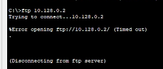{#fig:011 width=70%}

Настроем доступ к файловому серверу (рис.[-@fig:012]). В списке контроля доступа servers-out указано (в качестве
комментария-напоминания remark file), что следующие ограничения
предназначены для работы с file-сервером; всем узлам внутренней сети
(10.128.0.0) разрешён доступ по протоколу SMB (работает через порт 445
протокола TCP) к каталогам общего пользования; любым узлам разрешён
доступ к file-серверу по протоколу FTP. Запись 0.0.255.255 — обратная маска (wildcard mask).

{#fig:012 width=70%}

Настроем доступ к почтовому серверу (рис.[-@fig:013]). В списке контроля доступа servers-out указано (в качестве
комментария-напоминания remark mail), что следующие ограничения предназначены для работы с почтовым сервером; всем разрешён доступ
к почтовому серверу по протоколам POP3 и SMTP.

{#fig:013 width=70%}

Настроем доступ к DNS-серверу (рис.[-@fig:014]). В списке контроля доступа servers-out указано (в качестве
комментария-напоминания remark dns), что следующие ограничения предназначены для работы с DNS-сервером; всем узлам внутренней сети разрешён доступ к DNS-серверу через UDP-порт 53.

{#fig:014 width=70%}

Проверим доступность web-сервера (через браузер) не только по ip-адресу (рис.[-@fig:015]), но и по имени (рис.[-@fig:016]).

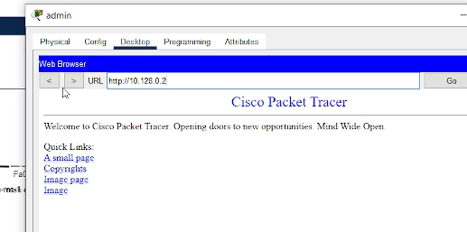{#fig:015 width=70%}

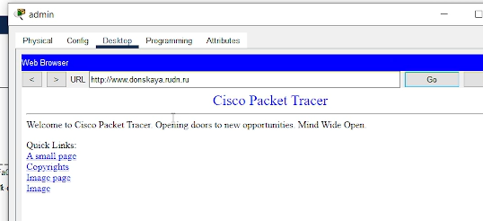{#fig:016 width=70%}

Разрешим icmp-запросы (рис.[-@fig:017]).

{#fig:017 width=70%}

Посмотрим номера строк правил в списке контроля доступа (рис.[-@fig:018]).

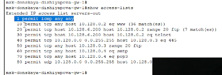{#fig:018 width=70%}

Настроем доступ для сети Other (рис.[-@fig:019]). Наложим ограничение на
исходящий из сети Other трафик, который по отношению к маршрутизатору
msk-donskaya-gw-1 является входящим трафиком. В списке контроля доступа other-in указано, что следующие правила
относятся к администратору сети; даётся разрешение устройству с адресом 10.128.6.200 на любые действия (any); к интерфейсу f0/0.104 подключается
список прав доступа other-in и применяется к входящему трафику (in).

{#fig:019 width=70%}

Настроем доступ администратора к сети сетевого оборудования (рис.[-@fig:020]). В списке контроля доступа management-out указано (в качестве
комментария-напоминания remark admin), что устройству администратора с адресом 10.128.6.200 разрешён доступ к сети сетевого оборудования
(10.128.1.0); к интерфейсу f0/0.2 подключается список прав доступа
management-out и применяется к исходящему трафику (out).

{#fig:020 width=70%}

# Самостоятельная работа

1. Проверим корректность установленных правил доступа, попытавшись получить доступ по различным протоколам с разных устройств сети к подсети
серверов и подсети сетевого оборудования.

Откроем терминал dep-donskaya-dishiyapova-1 и пропингуем разные устройства (рис.[-@fig:022]). Увидим, что серверы и другие оконечные устройства пингуются, однако к сетевому оборудованию доступа нет, как и должно быть.

{#fig:022 width=70%}

Откроем терминал dk-donskaya-dishiyapova-1 и пропингуем разные устройства (рис.[-@fig:023]). Увидим, что серверы и другие оконечные устройства пингуются, однако к сетевому оборудованию доступа нет, как и должно быть. Также попробуем подключится к web-серверу по ftp, доступ закрыт.

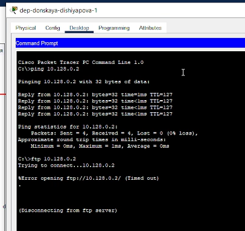{#fig:023 width=70%}

Теперь проверим корректность настроенного доступа с admin (рис.[-@fig:024]). Есть доступ к серверу по ftp, а также успешно пингуется сетевое оборудование.

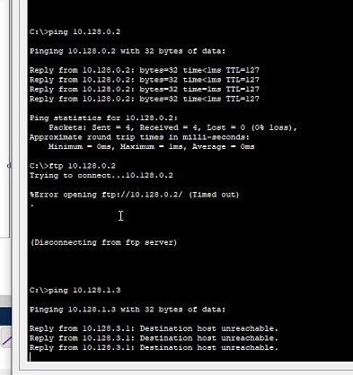{#fig:024 width=70%}

2. Разрешим администратору из сети Other на Павловской действия, аналогичные действиям администратора сети Other на Донской.

Разместим в рабочей области ноутбук admin-pavlovskaya на Павловской (рис.[-@fig:025]).

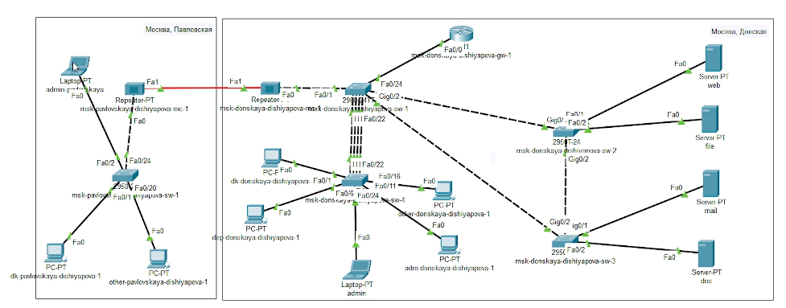{#fig:025 width=70%}

Настроем доступ для администратора на Павловской по протоколам Telnet и FTP, дадим разрешение устройству с адресом 10.128.6.201 на любые действия (any), настроем доступ администратора к сети сетевого оборудования (рис.[-@fig:026]).

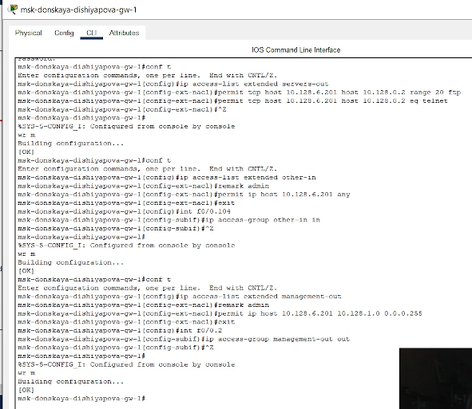{#fig:026 width=70%}

Проверим, что наша настройка доступов работает корректно (рис.[-@fig:028]).

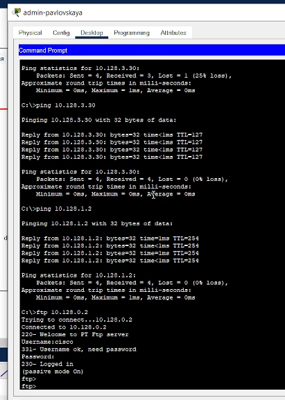{#fig:028 width=60%}

# Выводы

В процессе выполнения данной лабораторной работы я освоила настройку прав доступа пользователей к ресурсам сети.

# Контрольные вопросы

1. Как задать действие правила для конкретного протокола?

Например, `permit tcp any host 10.128.0.4 eq pop3`.

2. Как задать действие правила сразу для нескольких портов?

Для этого нужна команда `interface range`.

3. Как узнать номер правила в списке прав доступа?

С помощью команды `show access-lists`.

4. Каким образом можно изменить порядок применения правил в списке
контроля доступа?

Команда `access-list <номер в списке> permit`. 
