---
## Front matter
lang: ru-RU
title: Лабораторная работа № 11
subtitle: Настройка NAT.Планирование
author:
  - Шияпова Д.И.
institute:
  - Российский университет дружбы народов, Москва, Россия
date: 19 мая 2025

## i18n babel
babel-lang: russian
babel-otherlangs: english

## Formatting pdf
toc: false
toc-title: Содержание
slide_level: 2
aspectratio: 169
section-titles: true
theme: metropolis
header-includes:
 - \metroset{progressbar=frametitle,sectionpage=progressbar,numbering=fraction}
---

## Докладчик

:::::::::::::: {.columns align=center}
::: {.column width="70%"}

  * Шияпова Дарина Илдаровна
  * Студентка
  * Российский университет дружбы народов
  * [1132226458@pfur.ru](mailto:1132226458@pfur.ru)

:::
::: {.column width="30%"}

:::
::::::::::::::

## Цель работы

Провести подготовительные мероприятия по подключению локальной сети
организации к Интернету.

## Задание

1. Построить схему подсоединения локальной сети к Интернету;
2. Построить модельные сети провайдера и сети Интернет;
3. Построить схемы сетей L1, L2, L3;
4. При выполнении работы необходимо учитывать соглашение об именовании.

## Выполнение лабораторной работы

Network Address Translation (NAT) — механизм преобразования IP-адресов
транзитных пакетов.
В частности, механизм NAT используется для обеспечения доступа устройств
локальных сетей с внутренними IP-адресами к сети Интернет.

## Выполнение лабораторной работы
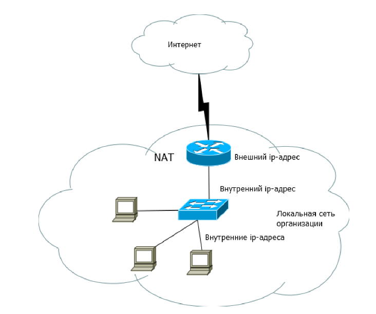{#fig:001 width=70%}

## Выполнение лабораторной работы
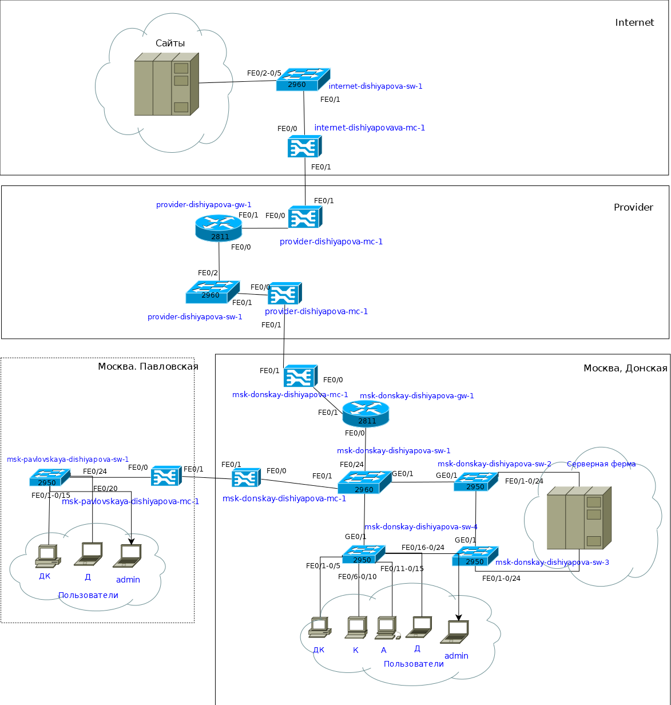{#fig:002 width=70%}

## Выполнение лабораторной работы

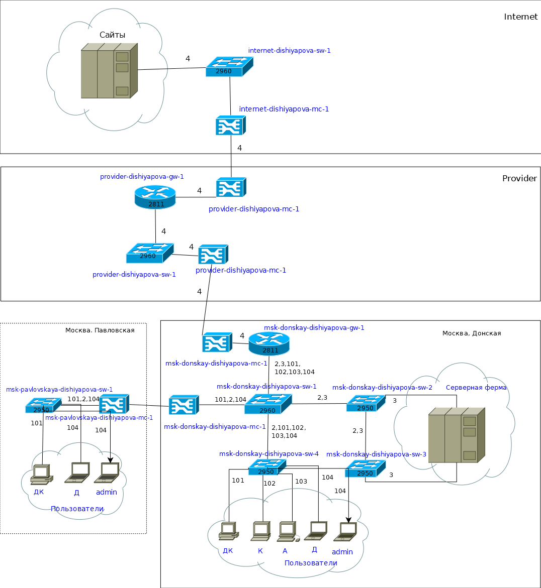{#fig:003 width=70%}

## Выполнение лабораторной работы

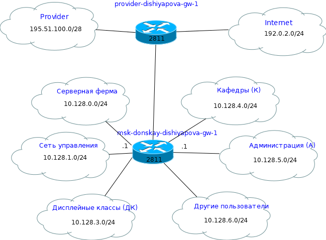{#fig:004 width=70%}

## Выполнение лабораторной работы

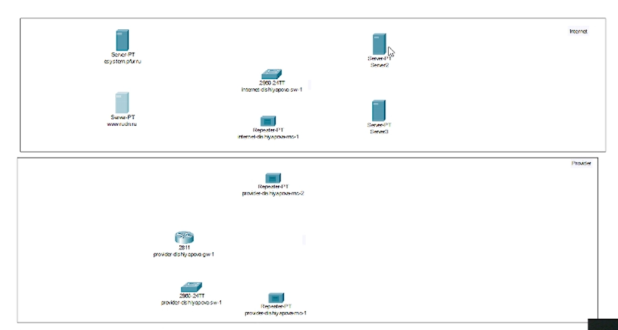{#fig:005 width=70%}

## Выполнение лабораторной работы

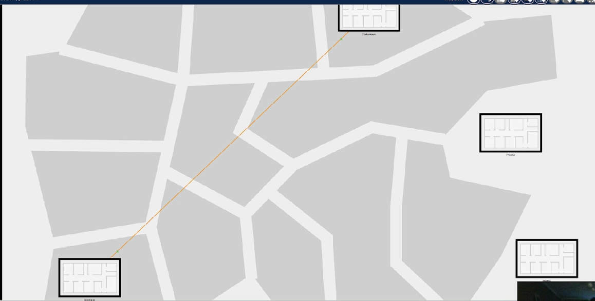{#fig:006 width=70%}

## Выполнение лабораторной работы

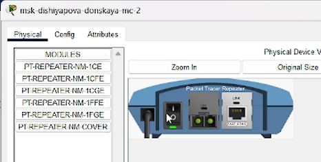{#fig:007 width=70%}

## Выполнение лабораторной работы

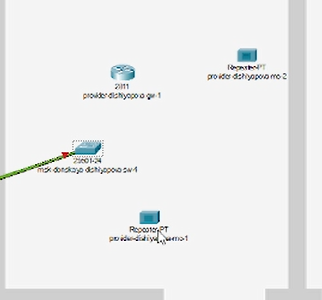{#fig:008 width=70%}

## Выполнение лабораторной работы

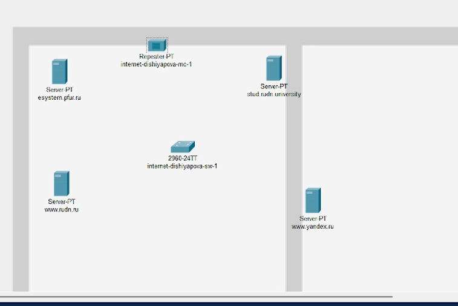{#fig:009 width=70%}

## Выполнение лабораторной работы

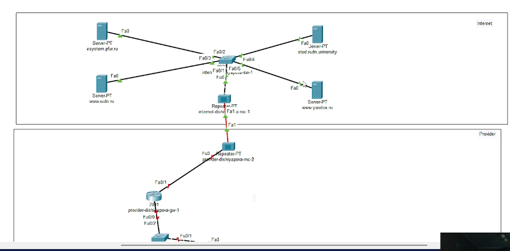{#fig:010 width=70%}

## Выполнение лабораторной работы

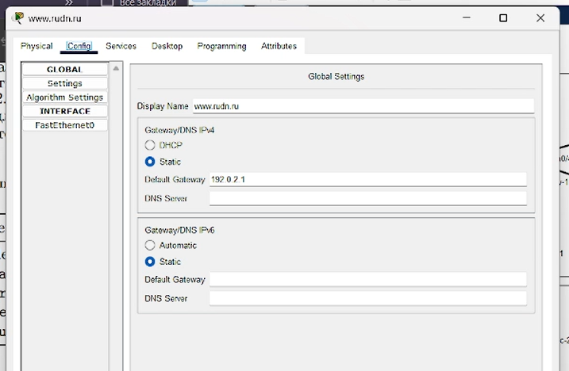{#fig:011 width=70%}

## Выполнение лабораторной работы

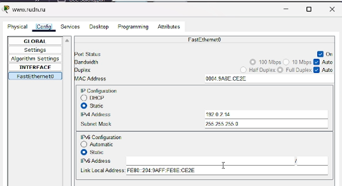{#fig:012 width=70%}

## Выполнение лабораторной работы

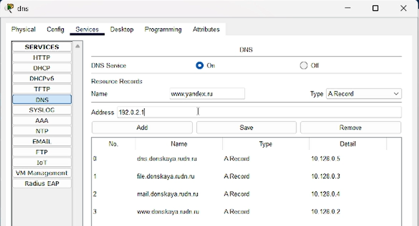{#fig:013 width=70%}

## Выводы

В процессе выполнения данной лабораторной работы я провела подготовительные мероприятия по подключению локальной сети организации к Интернету.

## Контрольные вопросы

1. Что такое Network Address Translation (NAT)?

Network Address Translation (NAT) — механизм преобразования IP-адресов транзитных пакетов. В частности, механизм NAT используется для обеспечения доступа устройств локальных сетей с внутренними IP-адресами к сети Интернет.

## Контрольные вопросы

2. Как определить, находится ли узел сети за NAT?

Проанализирорвать конфигурации маршрутизатора или другого сетевого оборудования, которое может выполнять функции NAT. 

## Контрольные вопросы

3. Какое оборудование отвечает за преобразование адреса методом NAT?

Преобразование адреса методом NAT может производиться почти любым маршрутизирующим устройством — маршрутизатором, сервером доступа, межсетевым экраном. Наиболее популярным является SNAT, суть механизма которого состоит в замене адреса источника (англ. source) при прохождении пакета в одну сторону и обратной замене адреса назначения (англ. destination) в ответном пакете.

## Контрольные вопросы

4. В чём отличие статического, динамического и перегруженного NAT?

Статический осуществляет преобразование адресов по принципу 1:1, динамический 1:N, а перегруженный N:1.

## Контрольные вопросы

5. Охарактеризуйте типы NAT.

Типы NAT:
- статический NAT (Static NAT, SNAT) -- осуществляет преобразование адресов по принципу 1:1 (в частности, один локальный IP-адрес преобразуется во внешний адрес, выделенный, например, провайдером);
- динамический NAT (Dynamic NAT, DNAT) -- осуществляет преобразование адресов по принципу 1:N (например, один адрес устройства локальной сети преобразуется в один из адресов диапазона внешних адресов);
- NAT Overload (или NAT Masquerading, или Port Address Translation, PAT) -- осуществляет преобразование адресов по принципу N:1 (например, адреса группы устройств локальной подсети преобразуются в один внешний адрес, при этом дополнительно используется механизм адресации через номера портов).
