---
## Front matter
lang: ru-RU
title: Лабораторная работа № 14
subtitle: Статическая маршрутизация в Интернете. Настройка.
author:
  - Шияпова Д.И.
institute:
  - Российский университет дружбы народов, Москва, Россия
date: 19 мая 2025

## i18n babel
babel-lang: russian
babel-otherlangs: english

## Formatting pdf
toc: false
toc-title: Содержание
slide_level: 2
aspectratio: 169
section-titles: true
theme: metropolis
header-includes:
 - \metroset{progressbar=frametitle,sectionpage=progressbar,numbering=fraction}
---


## Докладчик

:::::::::::::: {.columns align=center}
::: {.column width="70%"}

  * Шияпова Дарина Илдаровна
  * Студентка
  * Российский университет дружбы народов
  * [1132226458@pfur.ru](mailto:1132226458@pfur.ru)


:::
::: {.column width="30%"}


:::
::::::::::::::

## Цель работы

Настроить взаимодействие через сеть провайдера посредством статической маршрутизации локальной сети организации с сетью основного здания, расположенного в 42-м квартале в Москве, и сетью филиала, расположенного в г. Сочи.

## Задание

1. Настроить связь между территориями.
2. Настроить оборудование, расположенное в квартале 42 в Москве.
3. Настроить оборудование, расположенное в филиале в г. Сочи.
4. Настроить статическую маршрутизацию между территориями.
5. Настроить статическую маршрутизацию на территории квартала 42 в г.
Москве.
6. Настроить NAT на маршрутизаторе msk-donskaya-gw-1.
7. При выполнении работы необходимо учитывать соглашение об именовании.

## Выполнение лабораторной работы

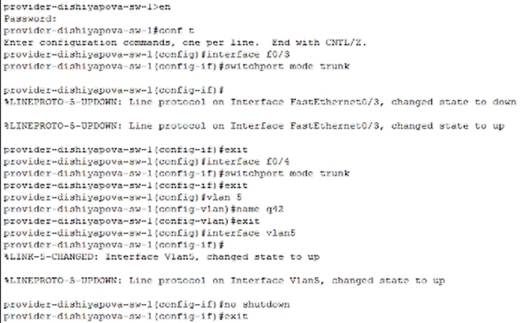{#fig:001 width=70%}

## Выполнение лабораторной работы

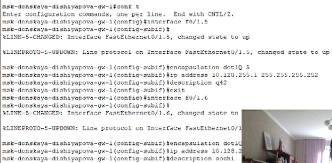{#fig:003 width=70%}

## Выполнение лабораторной работы

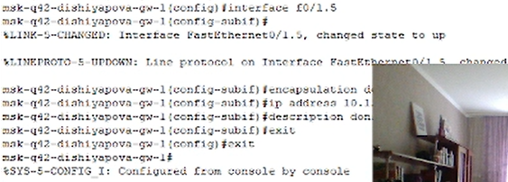{#fig:002 width=70%}

## Выполнение лабораторной работы

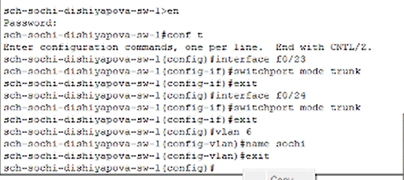{#fig:004 width=70%}

## Выполнение лабораторной работы

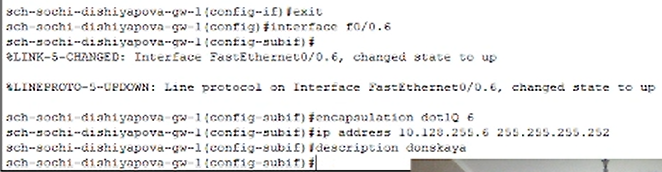{#fig:005 width=70%}

## Выполнение лабораторной работы

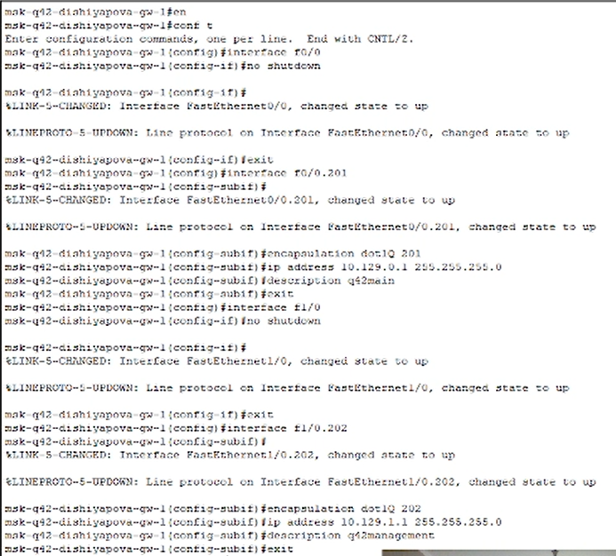{#fig:006 width=70%}

## Выполнение лабораторной работы

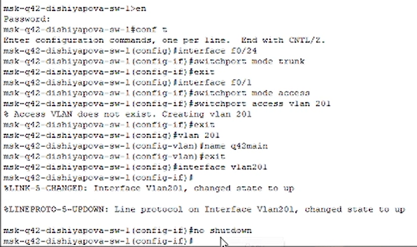{#fig:007 width=70%}

## Выполнение лабораторной работы

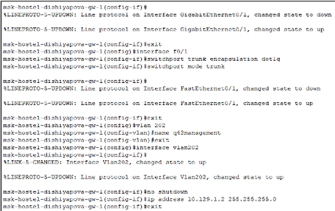{#fig:008 width=70%}

## Выполнение лабораторной работы

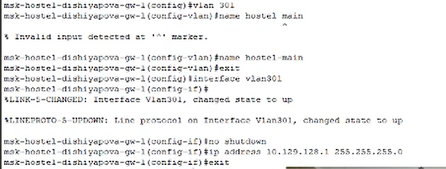{#fig:009 width=70%}

## Выполнение лабораторной работы

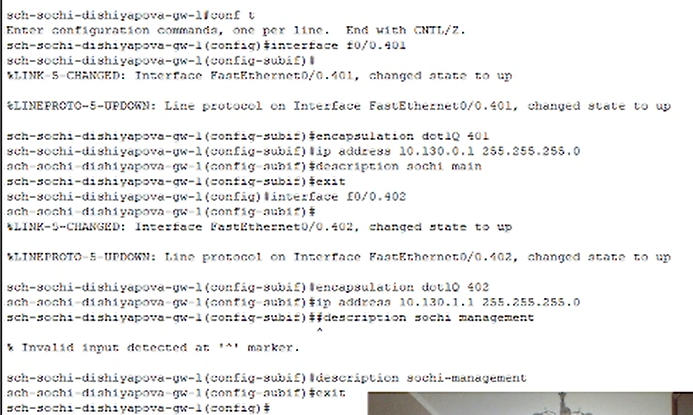{#fig:010 width=70%}

## Выполнение лабораторной работы

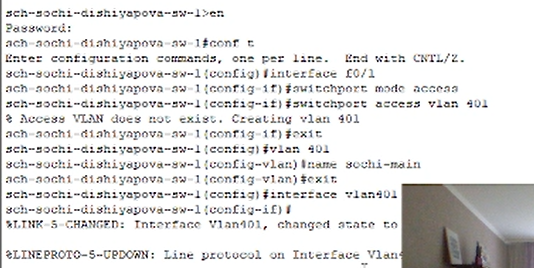{#fig:011 width=70%}

## Выполнение лабораторной работы

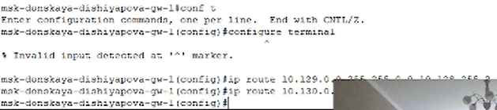{#fig:012 width=70%}

## Выполнение лабораторной работы

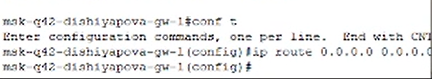{#fig:013 width=70%}

## Выполнение лабораторной работы

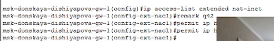{#fig:017 width=70%}

## Выполнение лабораторной работы

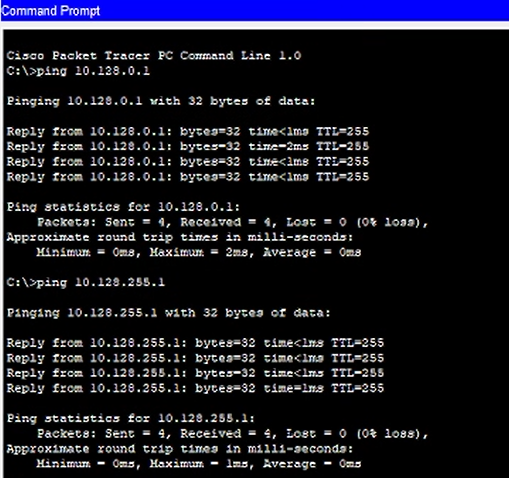{#fig:018 width=70%}

## Выполнение лабораторной работы

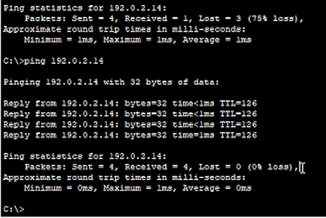{#fig:019 width=70%}

## Выводы

В результате выполнения лабораторной были приобретены практические навыки по настройке взаимодействие через сеть провайдера посредством статической маршрутизации локальной сети организации с сетью основного здания, расположенного в 42-м квартале в Москве, и сетью филиала, расположенного в г. Сочи.


## Контрольные вопросы

1. Приведите пример настройки статической маршрутизации между двумя подсетями организации.

```
(config)# ip route 192.168.2.0 255.255.255.0 192.168.1.2
(config)# ip route 192.168.1.0 255.255.255.0 192.168.2.1
```
## Контрольные вопросы

2. Опишите процесс обращения устройства из одного VLAN к устройству из другого VLAN.

- Определение VLAN:

Устройства в сети делятся на различные VLAN для управления трафиком и безопасности.
Каждый VLAN представляет собой логическую сегментацию сети, где устройства могут общаться только в пределах своего VLAN.

- Маршрутизация между VLAN:

Для обращения устройства из одного VLAN к устройству из другого VLAN требуется маршрутизация между VLAN.
Это может быть достигнуто с помощью маршрутизатора или многоуровневого коммутатора, способного работать на уровне маршрутизации.

- Пересылка трафика:

Когда устройство из одного VLAN отправляет пакет к устройству из другого VLAN, маршрутизатор или многоуровневый коммутатор принимает пакет, проверяет его адрес и пересылает его в соответствующий VLAN.

- Прием трафика:

Устройство в целевом VLAN принимает пакет и обрабатывает его в соответствии с его адресом и правилами безопасности VLAN.

## Контрольные вопросы

3. Как проверить работоспособность маршрута?

Командой `ping` или `traceroute`

## Контрольные вопросы

4. Как посмотреть таблицу маршрутизации?

Командой `show ip route`
