---
## Front matter
lang: ru-RU
title: Лабораторная работа № 15
subtitle: Динамическая маршрутизация
author:
  - Шияпова Д.И.
institute:
  - Российский университет дружбы народов, Москва, Россия
date: 19 мая 2025

## i18n babel
babel-lang: russian
babel-otherlangs: english

## Formatting pdf
toc: false
toc-title: Содержание
slide_level: 2
aspectratio: 169
section-titles: true
theme: metropolis
header-includes:
 - \metroset{progressbar=frametitle,sectionpage=progressbar,numbering=fraction}
---

## Докладчик

:::::::::::::: {.columns align=center}
::: {.column width="70%"}

  * Шияпова Дарина Илдаровна
  * Студентка
  * Российский университет дружбы народов
  * [1132226458@pfur.ru](mailto:1132226458@pfur.ru)

:::
::: {.column width="30%"}

:::
::::::::::::::

## Цель работы

Настроить динамическую маршрутизацию между территориями организации.

## Задание

1. Настроить динамическую маршрутизацию по протоколу OSPF на маршрутизаторах msk-donskaya-gw-1, msk-q42-gw-1, msk-hostel-gw-1, sch-sochi-gw-1.
2. Настроить связь сети квартала 42 в Москве с сетью филиала в г. Сочи напрямую.
3. В режиме симуляции отследить движение пакета ICMP с ноутбука администратора сети на Донской в Москве (Laptop-PT admin) до компьютера пользователя в филиале в г. Сочи pc-sochi-1.

## Задание
4. На коммутаторе провайдера отключить временно vlan 6 и в режиме симуляции убедиться в изменении маршрута прохождения пакета ICMP с ноутбука администратора сети на Донской в Москве (Laptop-PT admin) до компьютера пользователя в филиале в г. Сочи pc-sochi-1.
5. На коммутаторе провайдера восстановить vlan 6 и в режиме симуляции убедиться в изменении маршрута прохождения пакета ICMP с ноутбука администратора сети на Донской в Москве (Laptop-PT admin) до компьютера пользователя в филиале в г. Сочи pc-sochi-1.

## Выполнение лабораторной работы

Включим OSPF на маршрутизаторах: включим процесс OSPF командой `router ospf <process-id>`, и назначим области (зоны) интерфейсам с помощью команды
`network <network or IP address> <mask> area <area-id>`.

## Выполнение лабораторной работы

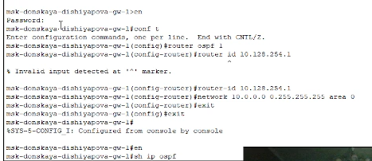{#fig:001 width=70%}

## Выполнение лабораторной работы

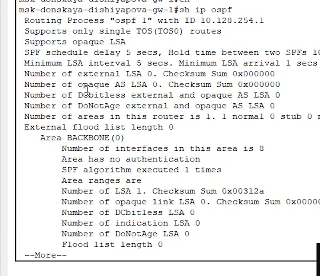{#fig:003 width=70%}

## Выполнение лабораторной работы

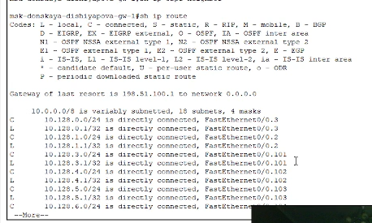{#fig:002 width=70%}

## Выполнение лабораторной работы

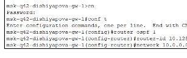{#fig:004 width=70%}

## Выполнение лабораторной работы

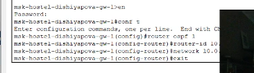{#fig:005 width=70%}

## Выполнение лабораторной работы

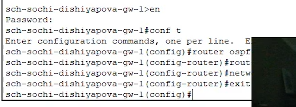{#fig:006 width=70%}

## Выполнение лабораторной работы

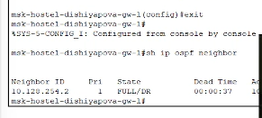{#fig:007 width=70%}

## Выполнение лабораторной работы

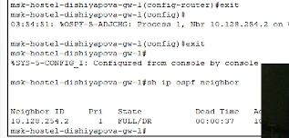{#fig:008 width=70%}

## Выполнение лабораторной работы

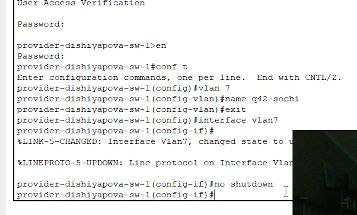{#fig:011 width=70%}

## Выполнение лабораторной работы

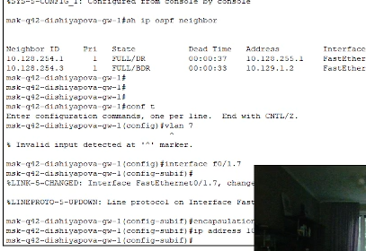{#fig:012 width=70%}

## Выполнение лабораторной работы

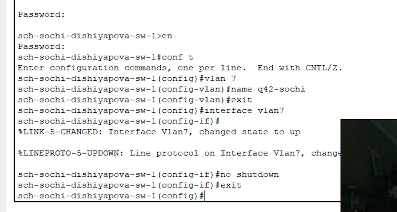{#fig:013 width=70%}

## Выполнение лабораторной работы

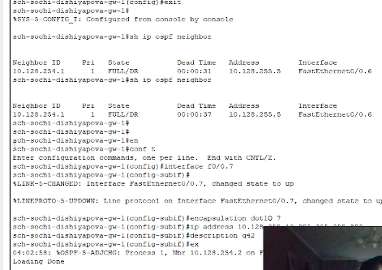{#fig:014 width=70%}

## Выполнение лабораторной работы

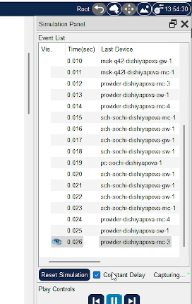{#fig:015 width=70%}

## Выполнение лабораторной работы

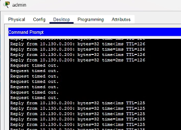{#fig:016 width=70%}

## Выполнение лабораторной работы

Потом включим vlan 6, и маршрут снова перестраивается на к кратчайший (на изначальный).

## Выводы

В результате выполнения данной лабораторной я приобрела практические навыки по настройке динамической маршрутизации между территориями организации.

## Контрольные вопросы

1. Какие протоколы относятся к протоколам динамической маршрутизации?

* RIP (Routing Information Protocol)
* OSPF (Open Shortest Path First)
* EIGRP (Enhanced Interior Gateway Routing Protocol)
* IS-IS (Intermediate System to Intermediate System)
* BGP (Border Gateway Protocol)

## Контрольные вопросы

2. Охарактеризуйте принципы работы протоколов динамической маршрутизации.

После включения маршрутизаторов протокол ищет непосредственно подключенных соседей и устанавливает с ними «дружеские» отношения.

Затем они обмениваются друг с другом информацией о подключенных и доступных им сетях, то есть строят карту сети (топологию сети).

На основе полученной информации запускается алгоритм SPF (Shortest Path First, «выбор наилучшего пути»), который рассчитывает оптимальный маршрут к каждой сети.

Данный процесс похож на построение дерева, корнем которого является сам маршрутизатор, а ветвями — пути к доступным сетям.

## Контрольные вопросы

3. Опишите процесс обращения устройства из одной подсети к устройству из другой подсети по протоколу динамической маршрутизации.

Когда устройство из одной подсети пытается связаться с устройством из другой подсети:

- Исходный маршрутизатор проверяет свою таблицу маршрутизации на наличие маршрута к целевому адресу назначения.
- Если маршрут найден, маршрутизатор отправляет сообщение по этому маршруту.
- Если маршрут не найден, маршрутизатор использует протокол динамической маршрутизации для запроса и получения маршрута к целевому адресу назначения.
- После получения маршрута маршрутизатор обновляет свою таблицу маршрутизации и отправляет сообщение по полученному маршруту.

## Контрольные вопросы

4. Опишите выводимую информацию при просмотре таблицы маршрутизации.

При просмотре таблицы маршрутизации отображается следующая информация:

- Адрес сети или узла назначения.

- Маску сети назначения.

- Шлюз — адрес маршрутизатора в сети, на который необходимо отправить пакет.

- Интерфейс, через который доступен шлюз.

- Метрику — числовой показатель, задающий предпочтительность маршрута.
