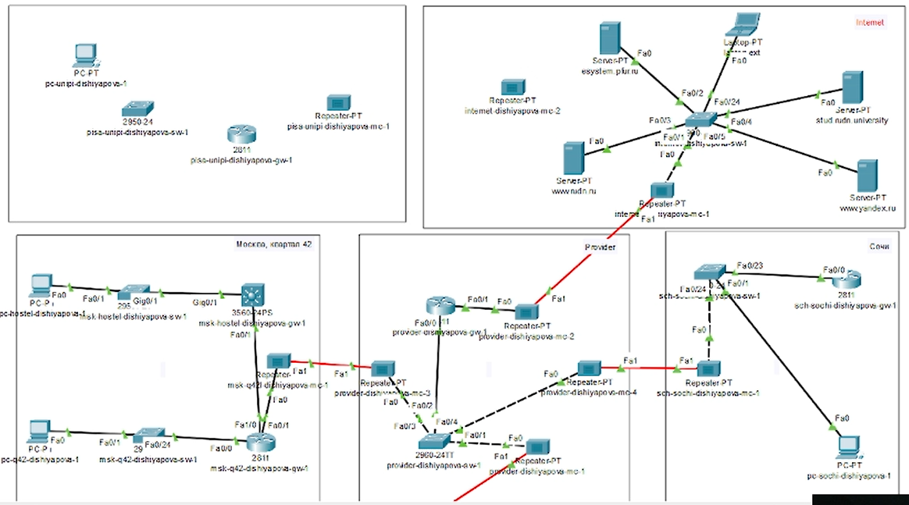
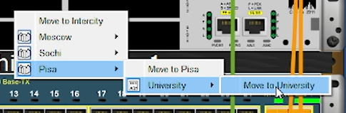
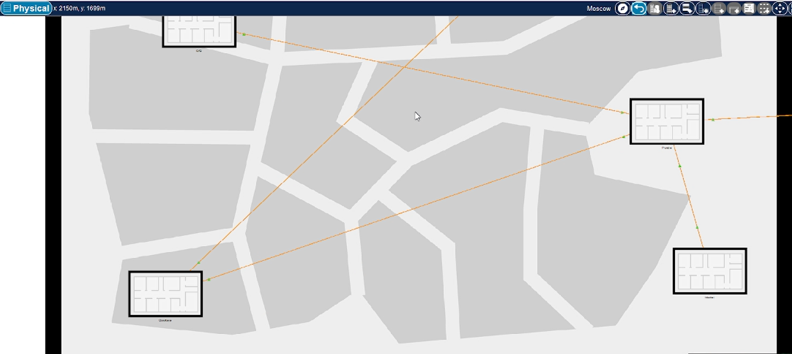
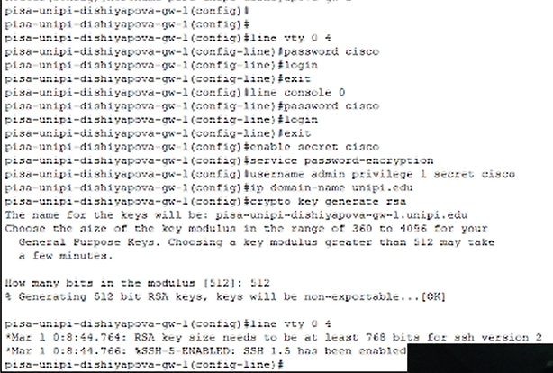
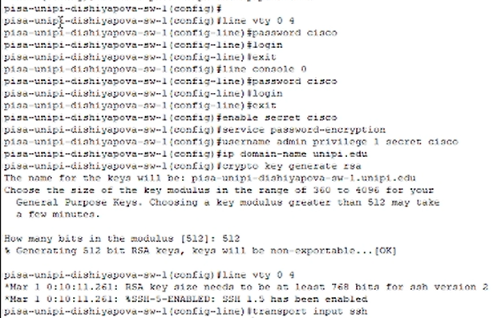
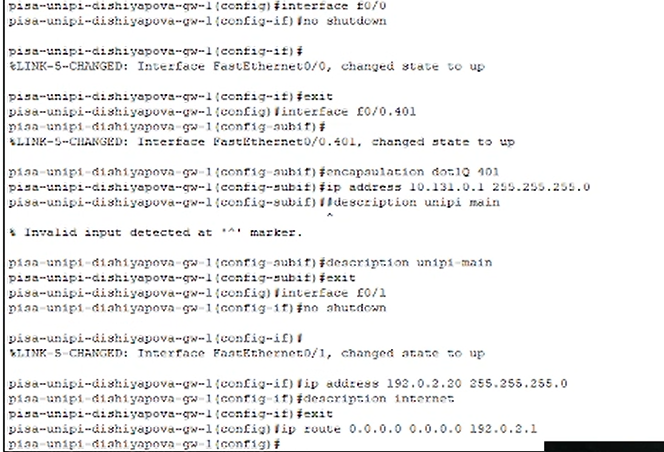
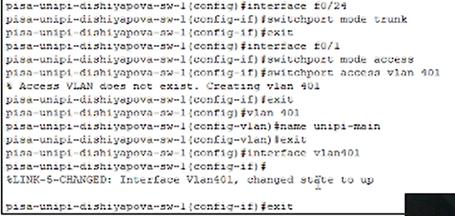
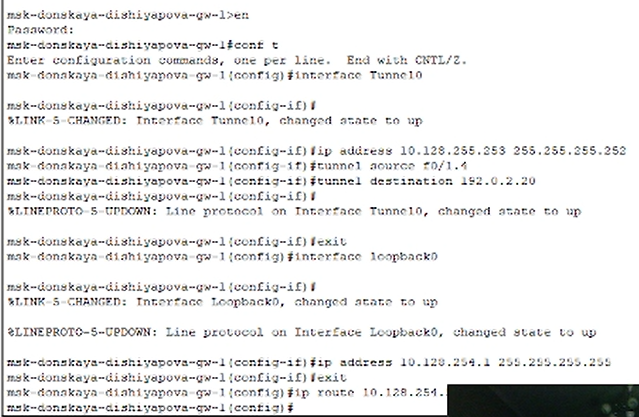
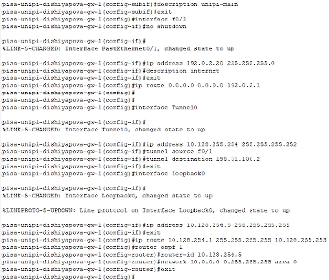
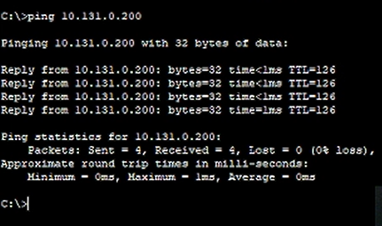

---
## Front matter
lang: ru-RU
title: Лабораторная работа № 16
subtitle: Настройка VPN
author:
  - Шияпова Д.И.
institute:
  - Российский университет дружбы народов, Москва, Россия
date: 19 мая 2025

## i18n babel
babel-lang: russian
babel-otherlangs: english

## Formatting pdf
toc: false
toc-title: Содержание
slide_level: 2
aspectratio: 169
section-titles: true
theme: metropolis
header-includes:
 - \metroset{progressbar=frametitle,sectionpage=progressbar,numbering=fraction}
---

## Докладчик

:::::::::::::: {.columns align=center}
::: {.column width="70%"}

  * Шияпова Дарина Илдаровна
  * Студентка
  * Российский университет дружбы народов
  * [1132226458@pfur.ru](mailto:1132226458@pfur.ru)

:::
::: {.column width="30%"}

:::
::::::::::::::

## Цель работы

Получить навыки настройки VPN-туннеля через незащищённое Интернет-соединение.

## Задание

1. Разместить в рабочей области проекта в соответствии с модельными предположениями оборудование для сети Университета г. Пиза.
2. В физической рабочей области проекта создать город Пиза, здание Университета г. Пиза. Переместить туда соответствующее оборудование.
3. Сделать первоначальную настройку и настройку интерфейсов оборудования
сети Университета г. Пиза.

## Задание

4. Настроить VPN на основе протокола GRE.
5. Проверить доступность узлов сети Университета г. Пиза с ноутбука администратора сети «Донская».

## Выполнение лабораторной работы

Виртуальная частная сеть (Virtual Private Network, VPN) — технология,
обеспечивающая одно или несколько сетевых соединений поверх другой сети
(например, Интернет).

Сеть Университета г. Пиза (Италия) содержит маршрутизатор Cisco 2811
pisa-inipi-gw-1, коммутатор Cisco 2950 pisa-unipi-sw-1 и оконечное устройство PC pc-unipi-1.

## Выполнение лабораторной работы

{#fig:002 width=70%}

## Выполнение лабораторной работы

{#fig:003 width=70%}

## Выполнение лабораторной работы

{#fig:004 width=70%}

## Выполнение лабораторной работы

{#fig:005 width=70%}

## Выполнение лабораторной работы

{#fig:006 width=70%}

## Выполнение лабораторной работы

{#fig:007 width=70%}

## Выполнение лабораторной работы

{#fig:008 width=70%}

## Выполнение лабораторной работы

{#fig:010 width=70%}

## Выполнение лабораторной работы

{#fig:011 width=70%}

## Выполнение лабораторной работы

{#fig:012 width=70%}

## Выводы

В результате выполнения данной лабораторной работы я получила навыки настройки VPN-туннеля через незащищённое Интернет-соединение.

## Контрольные вопросы

1. Что такое VPN?

Виртуальная частная сеть (Virtual Private Network, VPN) — технология,
обеспечивающая одно или несколько сетевых соединений поверх другой сети
(например, Интернет).

## Контрольные вопросы

2. В каких случаях следует использовать VPN?

VPN шифрует интернет-трафик, защищая данные от хакеров и интернет-провайдеров, что особенно важно в общедоступных Wi-Fi сетях. Он скрывает реальный IP-адрес, предотвращая отслеживание местоположения и онлайн-активности.
VPN помогает обходить цензуру и географические ограничения, предоставляя доступ к заблокированным сайтам и региональному контенту. Он также незаменим для безопасной работы в корпоративных сетях, позволяя сотрудникам удаленно подключаться к корпоративным ресурсам и защищая корпоративные данные от несанкционированного доступа.
VPN защищает от атак типа «человек посередине» и блокирует вредоносные веб-сайты и фишинговые атаки. Он также позволяет экономить на покупках, предоставляя доступ к региональным ценам на товары и услуги в интернете.
Примеры использования VPN включают защиту личной информации в общедоступных Wi-Fi сетях, обход географических ограничений, безопасную удаленную работу и анонимный серфинг. В современном цифровом мире, где угрозы кибербезопасности и ограничения доступа становятся все более распространенными, VPN является мощным инструментом для обеспечения безопасности и конфиденциальности.

## Контрольные вопросы

3. Как с помощью VPN обойти NAT?

Обход NAT с помощью VPN возможен благодаря тому, что VPN создает зашифрованное соединение между устройством пользователя и удаленным сервером, обходя при этом ограничения, налагаемые NAT. Это позволяет устройству пользователя обмениваться данными через интернет, игнорируя ограничения NAT.
